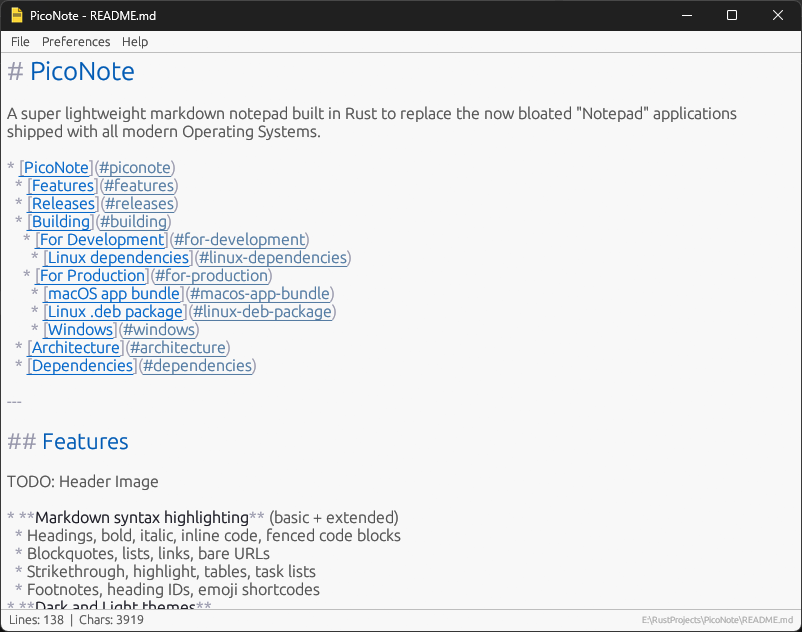
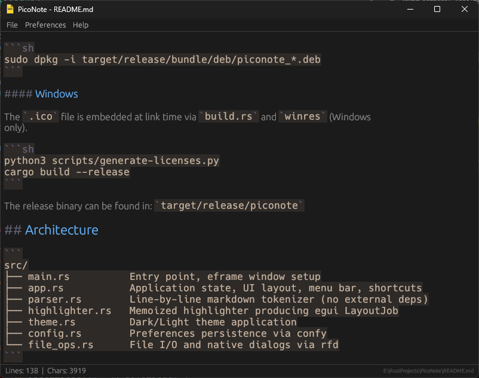

# PicoNote

 

> A super lightweight markdown notepad built in Rust to replace the now bloated "Notepad" applications shipped with all modern Operating Systems.

* [PicoNote](#piconote)
  * [Features](#features)
  * [Releases](#releases)
  * [Building](#building)
    * [For Development](#for-development)
    * [For Production](#for-production)
      * [macOS](#macos)
      * [Windows](#windows)
  * [Architecture](#architecture)
  * [Dependencies](#dependencies)

---


## Features

| | |
|:---:|:---:|
|||

* **Markdown syntax highlighting** (basic + extended)
  * Headings, bold, italic, inline code, fenced code blocks
  * Blockquotes, lists, links, bare URLs
  * Strikethrough, highlight, tables, task lists
  * Footnotes, heading IDs, emoji shortcodes
* **Dark and Light themes**
* **Configurable font size** (10–28 px)
* **Word wrap toggle**
* **Native file dialogs** (Open, Save, Save As)
* **Unsaved changes protection** with Save / Don't Save / Cancel
* **Keyboard shortcuts**
  * `Cmd/Ctrl+S` — Save
  * `Cmd/Ctrl+Shift+S` — Save As
  * `Cmd/Ctrl+O` — Open
  * `Cmd/Ctrl+N` — New
  * `Cmd/Ctrl+Plus/Minus` — Adjust font size
* **Status bar** with line count, character count, and file path
* **Cross-platform** (macOS, Windows)
* **Tiny binary** (~5 MB release build)
* **Preferences persist** across sessions

## Releases

Compiled releases are available in the [Releases section on GitHub](https://github.com/Sorcerio/PicoNote/releases).

## Building

Requires [Rust](https://rustup.rs/) 1.85+ (edition 2024) and Python 3.

### For Development

```sh
python3 scripts/generate-licenses.py
cargo build
cargo run
```

### For Production

The binary is fully self-contained with all license attributions viewable under `Help > Third-Party Licenses`.

#### macOS

Produces a `.app` package with the correct icon, bundle identifier, and `Info.plist` for Finder/Dock integration:

```sh
cargo install cargo-bundle
python3 scripts/generate-licenses.py
cargo bundle --release
```

The bundle can be found in: `target/release/bundle/osx/PicoNote.app`

#### Windows

The `.ico` file is embedded at link time via `build.rs` and `winres` (Windows
only).

```sh
python3 scripts/generate-licenses.py
cargo build --release
```

The release binary can be found in: `target/release/piconote`

## Architecture

```
src/
├── main.rs          Entry point, eframe window setup
├── app.rs           Application state, UI layout, menu bar, shortcuts
├── parser.rs        Line-by-line markdown tokenizer (no external deps)
├── highlighter.rs   Memoized highlighter producing egui LayoutJob
├── theme.rs         Dark/Light theme application
├── config.rs        Preferences persistence via confy
└── file_ops.rs      File I/O and native dialogs via rfd
```

## Dependencies

| Crate | Purpose |
|---|---|
| eframe/egui | GUI framework (glow backend) |
| rfd | Native file dialogs |
| serde | Serialization for config |
| confy | Config file management |
| font-kit | System font discovery |
| image | PNG decoding for runtime window icon |
